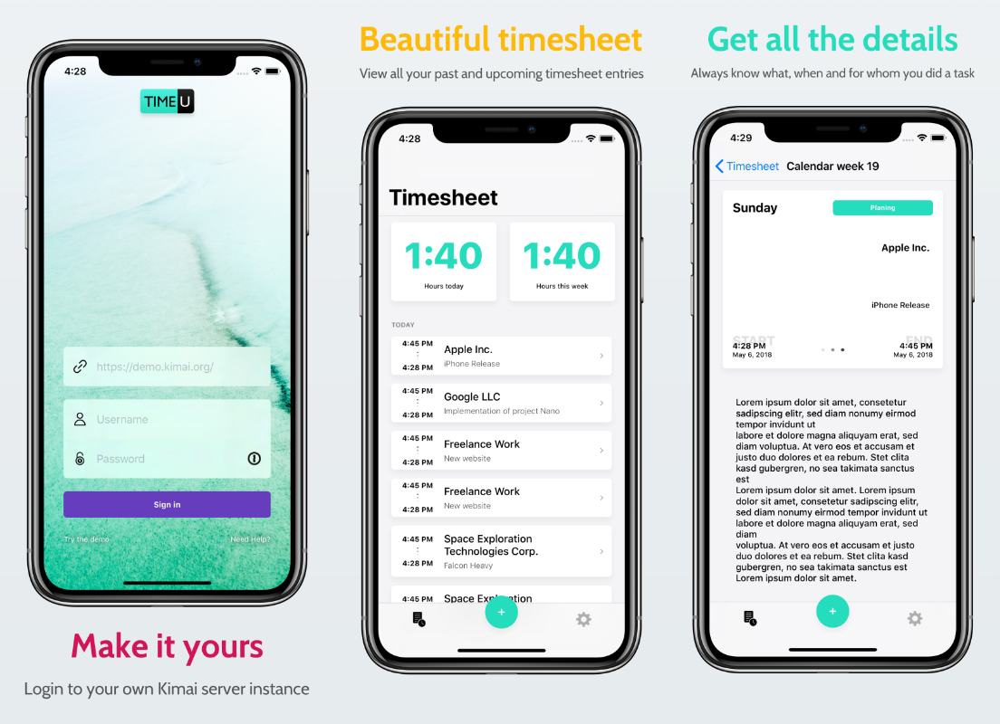

# Timeu - The modern [Kimai](https://www.kimai.org/) client for iOS

> ⚠️ **The development of Timeu is currently on hold**!
>
> [Kimai2](https://github.com/kevinpapst/kimai2), a complete rewrite of the original Kimai, is in full development. Due to this, the API is completely different and not yet fully implemented. I plan to ship Timeu with support for Kimai2 and drop the old Kimai API. You can check out the progress of the conversion on the [kimai2 branch](https://github.com/bastilimbach/timeu/tree/kimai2).

With **Timeu** you can view ~~, add, edit and delete~~ your Timesheet entries from your custom Kimai server.

# To Do's
- [x] Make the project open source
- [x] Add [SwiftLint](https://github.com/realm/SwiftLint) ([#1](https://github.com/bastilimbach/timeu/pull/1))
- [x] Add [fastlane](https://github.com/fastlane/fastlane) for automatic screenshot creation
- [ ] Add [fastlane](https://github.com/fastlane/fastlane) for automatic App Store deployment
- [ ] Add Tests
- [ ] Add rudimentary continuous integration
- [ ] Implement the ability to `add`, `edit` and `delete` timesheet records
- [ ] Refactor the NetworkController to get rid of the Singleton
- [ ] Publish v1.0.0 to the App Store

# Build from source
1. Clone the repository: `git clone https://github.com/bastilimbach/timeu`
2. Install the [Carthage](https://github.com/Carthage/Carthage) dependency manager
3. Install the iOS dependencies: `carthage update --platform iOS`
4. Install [SwiftLint](https://github.com/realm/SwiftLint)

> You might need to change the team and bundle identifier to run the project.

# Why am I building this?
1. Finally getting one of my swift based side projects onto the App Store.
2. Using the `MVC` architecture extensively in a medium sized app.
3. Getting to know the process behind submitting apps to the App Store.
4. Building the interface exclusively in code using [`SnapKit`](https://github.com/SnapKit/SnapKit).
5. Designing apps in [`Sketch`](https://www.sketchapp.com/) and coding these highly customized UIViews.
6. Fun!

And of course I'm building this Kimai client because I was tired of seeing this [old and outdated user interface](https://www.kimai.org/).

# Contribution
I'm really looking forward for your contribution! If you would like to add a new feature or rewrite sections because they are not *swifty* enough or something else. Either way, I'm super happy to accept Pull Requests. If you use any third party library or images, be sure to add them to the `Credits` struct in `Model/Credits.swift`.

Please note that this project is released with a [Contributor Code of Conduct](https://github.com/bastilimbach/timeu/blob/master/.github/CODE_OF_CONDUCT.md). By participating in this project you agree to abide by its terms.

# License
[Mozilla Public License Version 2.0](https://github.com/bastilimbach/timeu/blob/master/LICENSE)
